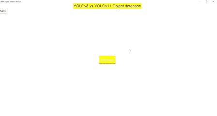

# Rock, Paper, Scissors Detection using YOLOv8 and YOLOv11 with Tkinter

This project demonstrates how to detect Rock, Paper, and Scissors gestures using the YOLOv8 and YOLOv11 models. The detection is integrated with a Tkinter-based graphical user interface (GUI), enabling real-time interaction with the system. The system identifies the hand gesture and displays the corresponding result.

## Demo GIF


## Demo Video
Watch the full demo video on YouTube:  
[Demo Video](https://youtu.be/VFkYDRcwSUY)

## Features
- Real-time gesture recognition for Rock, Paper, and Scissors.
- Utilizes YOLOv8 and YOLOv11 models for hand gesture detection.
- Tkinter GUI for real-time feedback.
- Supports both image and webcam inputs for gesture recognition.

## Prerequisites

To begin, please install the required libraries by running the following command:

```bash
pip install opencv-python Pillow torch pandas requests
```
## Steps on how to build this project
### Step 1: 
Obtain the Dataset The dataset can be accessed from Roboflow at the following link: [Roboflow Dataset](https://universe.roboflow.com/roboflow-58fyf/rock-paper-scissors-sxsw/dataset/14) 
### Step 2: 
Train the Model Use the following Google Colab notebooks to train the model: 
- **YOLOv8**: [Google Colab Notebook](https://colab.research.google.com/drive/1ToYYk5D-KLa1Qz_0CuRLCLT7DuOlK-1f?usp=sharing)
- **YOLOv11**: [Google Colab Notebook](https://colab.research.google.com/drive/1C-4kNeilbdiPaYQeybFSQoVpf6YYhIqB?usp=sharing)
  
### Step 3: 
Develop the Desktop GUI Application Develop a desktop GUI application, implement the trained model, and integrate it into the app.

[View the Report](https://1drv.ms/w/c/ecf96967acd2fef2/EQnar0OakC1Kt-QYEet5uBcB4eZRtcrjmQKCwwZGybox7A?e=kbP9HC)

